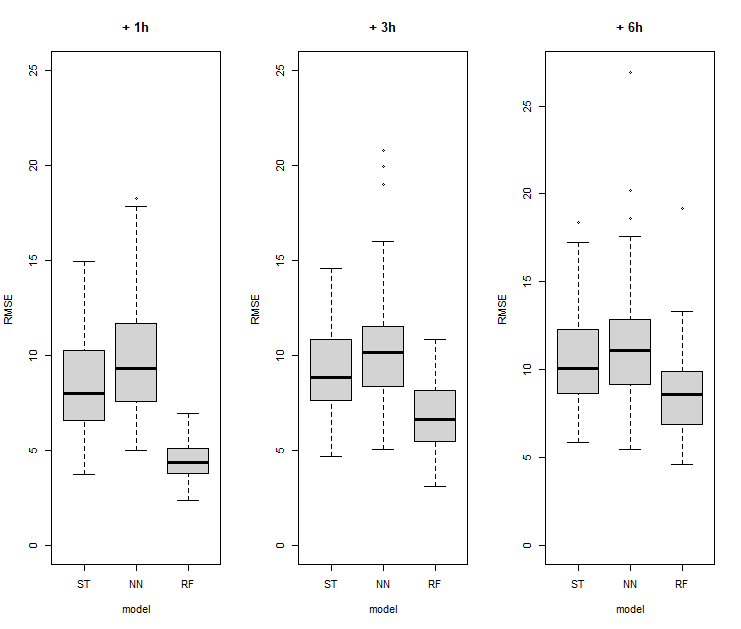

# Spatio-Temporal Interpolation for AQI data

The source code for "Spatio-Temporal Interpolation for AQI data".

## Data 

```bash 
data
|-- airkorea                  # raw data - airkorea
|-- airkorea.rds              # preprocessed data (src/data/airkorea.R)
|-- csv                       # train/test data (src/data/traintest.R)
|-- kma                       # raw data - kma
|-- kmadata.rds               # preprocessed data (src/data/kmadata.R)
|-- observatory_airkorea.csv  # raw data - airkorea stataion
|-- observatory_kma.csv       # raw data - kma station
`-- testind_May.rds           # test index (src/data/traintest.R)
```

### Raw Data 

Due to copyright issues, raw data are not provided. You can download the files from the following urls.

* Air pollution data (`data/airkorea/*.xlsx`): 에어코리아 [최종확정 측정자료 조회](https://www.airkorea.or.kr/web/last_amb_hour_data?pMENU_NO=123)

```
     지역          망    측정소코드    측정소명      측정일시      SO2     CO       O3      NO2    PM10    PM25                     주소
서울 중구    도시대기        111121        중구    2020010101    0.003    0.5    0.002    0.036      24      19    서울 중구 덕수궁길 15
서울 중구    도시대기        111121        중구    2020010102    0.003    0.6    0.001    0.039      25      21    서울 중구 덕수궁길 15
서울 중구    도시대기        111121        중구    2020010103    0.003    0.9    0.001    0.037      29      23    서울 중구 덕수궁길 15
서울 중구    도시대기        111121        중구    2020010104    0.002    0.6    0.001    0.036      26      22    서울 중구 덕수궁길 15
서울 중구    도시대기        111121        중구    2020010105    0.002    0.6    0.001    0.035      25      19    서울 중구 덕수궁길 15
```

* Airkorea station data (`data/observatory_airkorea.csv`): 에어코리아 [대기환경 월간/연간 보고서](https://www.airkorea.or.kr/web/detailViewDown?pMENU_NO=125)  (station: 지점, lat: 위도, log: 경도)

```
r$> observatory_airkorea %>% head()
station       log     lat
 111121  126.9747 37.5643
 111123  127.0050 37.5720
 111131  127.0048 37.5400
 111141  127.0925 37.5472
 111142  127.0419 37.5432
```

* Weather data (`data/kma/*.csv`): 대한민국 기상청 [종관기상관측(ASOS) 자료](https://data.kma.go.kr/data/grnd/selectAsosRltmList.do)

```
loc        datetime temp prec windspeed winddirection humidity vaporpres DPtemp  Lpres  Bpres sunshine radiation snow snow3 totalcloud MLcloud cloudshape lowcloud visibility groudstate groundtemp
 90 2018-01-01 0:00 -1.0   NA       1.1           250       23       1.3  -19.5 1019.4 1021.7       NA        NA   NA    NA         NA      NA                  NA       2000         NA       -2.3
 90 2018-01-01 1:00 -2.1   NA       1.7           230       28       1.5  -18.2 1019.7 1022.0       NA        NA   NA    NA         NA      NA                  NA       2000         NA       -2.7
 90 2018-01-01 2:00 -2.1   NA       1.4           160       29       1.5  -17.7 1020.1 1022.4       NA        NA   NA    NA         NA      NA                  NA       2000         NA       -3.0
 90 2018-01-01 3:00 -2.2   NA       0.9           230       28       1.5  -18.2 1020.4 1022.7       NA        NA   NA    NA         NA      NA                  NA       2000         NA       -3.2
 90 2018-01-01 4:00 -2.0   NA       1.2           250       27       1.4  -18.5 1020.4 1022.7       NA        NA   NA    NA         NA      NA                  NA       2000         NA       -3.3
 90 2018-01-01 5:00 -1.7   NA       1.4           270       26       1.4  -18.7 1020.7 1023.0       NA        NA   NA    NA         NA      NA                  NA       2000         NA       -3.1
```

* KMA station data (`data/observatory_kma.csv`): 대한민국 기상청 [관측지점정보 자료](https://data.kma.go.kr/tmeta/stn/selectStnList.do) (index: 지점, lat: 위도, lon: 경도)

```
index     lat      lon
   90 38.2509 128.5647
   93 37.9474 127.7544
   95 38.1479 127.3042
   98 37.9019 127.0607
   99 37.8859 126.7665
   99 37.8859 126.7665
```

or use simultion data

### Preprocessing 

see `src/data` directory (written in `R`).

## Models 

* Random Effects with Spatio-Temporal Basis Functions: see `src/model/ST` directory (written in `R`).
* Neural Networks model: see `src/model/NN` directory (written in `Python`).
* Random Forest model: see `src/model/RF` directory (written in `R`).

## Results

The following table displays (50%, 75%) quantile of RMSE using three methods. Each column in the table means quantile of 1-step, 3-step, and 6-step forecasting from left to right.

| Model |  (50%, 75%) & +1h | (50%, 75%) & +3h  | (50%, 75%) & +6h  |
|---|---|---|---|
| ST  | (8.0088, 10.2268)  | (8.8609, 10.7955)  | (10.0435, 12.2510)  |
| NN  |  (9.3418, 11.6526) |  (10.1430, 11.4923)  |  (11.1114, 12.7896)  |
| RF  | (4.3464, 5.0956)  | (6.6421, 8.1415)  |  (8.5955, 9.8522)  |

The following figure shows the plot between prediction and real value of PM2.5 using three methods ST, NN, and RF model(from top to bottom). 


The following figure is a boxplot of RMSE for each methods.



## Contacts

Should you have any queries or suggestions, you should contact either:

- [Kyeongeun Kim](mailto:kke712@snu.ac.kr)
- [Kyeongwon Lee](mailto:lkw1718@snu.ac.kr)
- [Miru Ma](mailto:mamilu63178@naver.com)

## Requirments

### R

```R
list.of.packages <- c(
    "tidyverse",
    "lubridate",
    "purrr",
    "phylin",
    "progress",
    "parallel",
    "randomForest",
    "tictoc",
    "spacetime",
    "FRK",
    "INLA",
    "foreach",
    "doParallel",
    "Metrics"
)
new.packages <- list.of.packages[!(list.of.packages %in% installed.packages()[, "Package"])]
if (length(new.packages)) {
    install.packages(new.packages)
}
```

### Python

(optional) packages for NN model.

```bash
requirements
|-- conda.txt
`-- pip.txt
```


## LICENSE

TBA